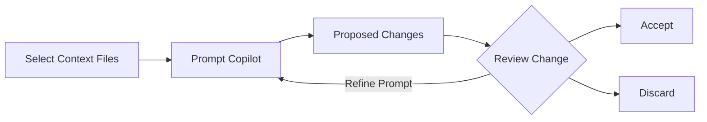

[x-review.md](https://github.com/user-attachments/files/25221210/x-review.md)[4-copilot-agent-mode.md](https://github.com/user-attachments/files/25221205/4-copilot-agent-mode.md)[1-preparing.md](https://github.com/user-attachments/files/25221198/1-preparing.md)
## Step 1: Hello Copilot

Welcome to your **"Getting Started with GitHub Copilot"** exercise! :robot:

In this exercise, you will be using different GitHub Copilot features to work on a website that allows students of Mergington High School to sign up for extracurricular activities. 🎻 ⚽️ ♟️


### 📖 Theory: Getting to know GitHub Copilot


GitHub Copilot is an AI coding assistant that helps you write code faster and with less effort, allowing you to focus more energy on problem solving and collaboration.

GitHub Copilot has been proven to increase developer productivity and accelerate the pace of software development. For more information, see [Research: quantifying GitHub Copilot’s impact on developer productivity and happiness in the GitHub blog.](https://github.blog/news-insights/research/research-quantifying-github-copilots-impact-on-developer-productivity-and-happiness/)

As you work in your IDE, you'll most often interact with GitHub Copilot in the following ways:

| Interaction Mode          | 📝 Description                                                                                                                                      | 🎯 Best For                                                                                                      |
| ------------------------- | --------------------------------------------------------------------------------------------------------------------------------------------------- | ---------------------------------------------------------------------------------------------------------------- |
| **⚡ Inline suggestions** | AI-powered code suggestions that appear as you type, offering context-aware completions from single lines to entire functions.                      | Completion of the current line, sometimes a whole new block of code                                              |
| **💬 Ask Mode**           | Optimized for answering questions about your codebase, coding, and general technology concepts.                                                     | Understanding how code works, brainstorming ideas, asking questions                                              |
| **✏️ Edit Mode**          | Optimized for making code edits across multiple files in your project. VS Code directly applies the code changes in the editor for in-place review. | Coding tasks when you have a good understanding of the changes you want to make and which files you want to edit |
| **🤖 Agent Mode**         | Optimized for making autonomous edits across multiple files in your project.                                                                        | Coding tasks when you have a less well-defined task that might also require running terminal commands and tools  |
| **💭 Inline Chat**        | Interactive chat scoped to your current file or selection. Ask questions about specific code blocks.                                                | Code explanations, debugging specific functions, targeted improvements                                           |

As you work, you'll find GitHub Copilot can help out in several places across the `github.com` website and in your favorite coding environments such as VS Code, Jet Brains, and Xcode!

For today's coding though, we will practice with VS Code in a pre-configured development environment known as a [GitHub Codespace](https://github.com/features/codespaces).

> [!TIP]
> You can learn more about current and upcoming features in the [GitHub Copilot Features](https://docs.github.com/en/copilot/about-github-copilot/github-copilot-features) documentation.

### :keyboard: Activity: Get a project intro from Copilot Chat

Let's start up our development environment, use copilot to learn a bit about the project, and then give it a test run.

1. Use the below button to open the **Create Codespace** page in a new tab. Use the default configuration.

   [](https://codespaces.new/{{full_repo_name}}?quickstart=1)

1. Confirm the **Repository** field is your copy of the exercise, not the original, then click the green **Create Codespace** button.

   - ✅ Your copy: `/{{full_repo_name}}`
   - ❌ Original: `/skills/getting-started-with-github-copilot`

1. Wait a moment for Visual Studio Code to load in your browser.

1. In the left sidebar, click the extensions tab and verify that the `GitHub Copilot` and `Python` extensions are installed and enabled.

   

   

1. At the top of VS Code, locate and click the **Toggle Chat icon** to open a Copilot Chat side panel.

   

   > 🪧 **Note:** If this is your first time using GitHub Copilot, you will need to accept the usage terms to continue.

1. Make sure you are in **Ask Mode** for our first interaction


   
1. Enter the below prompt to ask Copilot to introduce you to the project.

   > 
   >
   > ```prompt
   > @workspace Please briefly explain the structure of this project.
   > What should I do to run it?
   > ```

   > 🪧 **Note:** It is not necessary to follow Copilot's recommended instructions. We have already prepared the environment for you.

   <details>
   <summary>What is @workspace?</summary>

   Great question! This is a specialized [chat participant](https://docs.github.com/en/copilot/using-github-copilot/copilot-chat/github-copilot-chat-cheat-sheet?tool=vscode#chat-participants) that will explore the project repository and try to include relevant additional context.

   </details>

1. Now that we know a bit more about the project, let's actually try running it! In the left sidebar, select the `Run and Debug` tab and then press the **Start Debugging** icon.

   

1. We want to see our webpage running in a browser, so let's find the url and port. If it isn't visible, expand the lower panel and select the **Ports** tab.

1. In the list, find port `8000` and the related link. Hover over the link and select the **Open in browser** icon.

   

### :keyboard: Activity: Use Copilot to help remember a terminal command 🙋

Great work! Now that we are familiar with the app and we know it works, let's ask copilot for help starting a branch so we can do some customizing.

1. In VS Code's bottom panel, select the **Terminal** tab and on the right side click the plus `+` sign to create a new terminal window.

   > 🪧 **Note:** This will avoid stopping the existing debug session that is hosting our web application service.

1. Within the new terminal window use the keyboard shortcut `Ctrl + I` (windows) or `Cmd + I` (mac) to bring up **Copilot's Terminal Inline Chat**.

1. Let's ask Copilot to help us remember a command we have forgotten: creating a branch and publishing it.

   > 
   >
   > ```prompt
   > Hey copilot, how can I create and publish a new Git branch called "accelerate-with-copilot"?
   > ```

   > 💡 **Tip:** If Copilot doesn't give you quite what you want, you can always continue explaining what you need. Copilot will remember the conversation history for follow-up responses.

1. Press the `Run` button to let Copilot insert the terminal command for us. No need to copy and paste!

1. After a moment, look in the VS Code lower status bar, on the left, to see the active branch. It should now say `accelerate-with-copilot`. If so, you are all done with this step!

1. Now that your branch is pushed to GitHub, Mona should already be busy checking your work. Give her a moment and keep watch in the comments. You will see her respond with progress info and the next lesson.

<details>
<summary>Having trouble? 🤷</summary><br/>

If you don't get feedback, here are some things to check:

- Make sure your created the branch with the exact name `accelerate-with-copilot`. No prefixes or suffixes.
- Make sure the branch was indeed published to your repository.

</details>


[2-first-introduction.md](https://github.com/user-attachments/files/25221202/2-first-introduction.md)
## Step 2: Getting work done with Copilot

In the previous step, GitHub Copilot was able to help us onboard to the project. That alone is a huge time saver, but now let's get some work done!

:bug: **THERE IS A BUG ON THE WEBSITE** :bug:

We’ve discovered that something’s off in the signup flow.
Students can currently register for the same activity **more than once**! Let’s see how far Copilot can take us in uncovering the cause and shaping a clean fix.

Before we dive in, a quick primer on how Copilot works. 🧑‍🚀

### 📖 Theory: How Copilot works

In short, you can think of Copilot like a very specialized coworker. To be effective with them, you need to provide them background (context) and clear direction (prompts). Additionally, different people are better at different things because of their unique experiences (models).

- **How do we provide context?:** In our coding environment, Copilot will automatically consider nearby code and open tabs. If you are using chat, you can also explicitly refer to files.

- **What model should we pick?:** For our exercise, it shouldn't matter too much. Experimenting with different models is part of the fun! That's another lesson! 🤖

- **How do I make prompts?:** Being explicit and clear helps Copilot do the best job. But unlike some traditional systems, you can always clarify your direction with followup prompts.

> [!TIP]
> There several other ways to supplement Copilot's knowledge and capabilities like [chat participants](https://docs.github.com/en/copilot/using-github-copilot/copilot-chat/github-copilot-chat-cheat-sheet?tool=vscode#chat-participants), [chat variables](https://docs.github.com/en/copilot/using-github-copilot/copilot-chat/github-copilot-chat-cheat-sheet?tool=vscode#chat-variables), [slash commands](https://docs.github.com/en/copilot/using-github-copilot/copilot-chat/github-copilot-chat-cheat-sheet?tool=vscode#slash-commands-1), and [MCP tools](https://code.visualstudio.com/docs/copilot/chat/mcp-servers).

### :keyboard: Activity: Use Copilot to fix our registration bug :bug:

1. Let's ask Copilot to suggest where our bug might be coming from. Open the **Copilot Chat** panel in **Ask mode** and ask the following.

   > 
   >
   > ```prompt
   > @workspace Students are able to register twice for an activity.
   > Where could this bug be coming from?
   > ```

1. Now that we know the issue is in the `src/app.py` file and the `signup_for_activity` method, let's follow Copilot's recommendation and go fix it (semi-manually). We'll start with a comment and let Copilot finish the correction.

   1. In VS Code, select the file **Explorer tab** to show the project files and open the `src/app.py` file.

   1. Scroll near the bottom of the file and find the `signup_for_activity` method.

   1. Find the comment line that describes adding a student. Above this is where it seems logical to do our registration check.

   1. Enter the below comment and press enter to go to the next line. After a moment, temporary shadow text will appear with a suggestion from Copilot! Nice! :tada:

      ```python
      # Validate student is not already signed up
      ```

   1. Press `Tab` to accept Copilot's suggestion and convert the shadow text to code.

   <details>
   <summary>Example Results</summary><br/>

   Copilot is growing every day and may not always produce the same results. If you are unhappy with the suggestions, here is an example of a valid suggestion result we produced during the making of this exercise. You can use it to continue forward.

   ```python
   @app.post("/activities/{activity_name}/signup")
   def signup_for_activity(activity_name: str, email: str):
      """Sign up a student for an activity"""
      # Validate activity exists
      if activity_name not in activities:
         raise HTTPException(status_code=404, detail="Activity not found")

      # Get the activity
      activity = activities[activity_name]

      # Validate student is not already signed up
      if email in activity["participants"]:
        raise HTTPException(status_code=400, detail="Student is already signed up")

      # Add student
      activity["participants"].append(email)
      return {"message": f"Signed up {email} for {activity_name}"}
   ```

   </details>

### :keyboard: Activity: Let Copilot generate sample data 📋

In new project developments, it's often helpful to have some realistic looking fake data for testing. Copilot is excellent at this task, so let's add some more sample activities and introduce another way to interact with Copilot using **Inline Chat**

**Inline Chat** and the **Copilot Chat** panel are similar, but differ in scope: Copilot Chat handles broader, multi-file or exploratory questions; Inline Chat is faster when you want targeted help on the exact line or block in front of you.

1. Near the top of the `src/app.py` file (about line 23), find the `activities` variable, where our example extracurricular activities are configured.

1. Click on any of the related lines and bring up Copilot inline chat by using the keyboard command `Ctrl + I` (windows) or `Cmd + I` (mac).

   > 💡 **Tip:** Another way to bring up Copilot inline chat is: `right click` on any of the selected lines -> `Copilot` -> `Editor Inline Chat`.

1. Enter the following prompt text and press enter or the **Send and Dispatch** button.

   > 
   >
   > ```prompt
   > Add 2 more sports related activities, 2 more artistic
   > activities, and 2 more intellectual activities.
   > ```

1. After a moment, Copilot will directly start making changes to the code. The changes will be stylized differently to make any additions and removals easy to identify. Take a moment to inspect and then press the **Accept** button.

   <details>
   <summary>Example Results</summary><br/>

   Copilot is growing every day and may not always produce the same results. If you are unhappy with the suggestions, here is an example result we produced during the making of this exercise. You can use it to continue forward, if having trouble.

   ```python
   # In-memory activity database
   activities = {
      "Chess Club": {
         "description": "Learn strategies and compete in chess tournaments",
         "schedule": "Fridays, 3:30 PM - 5:00 PM",
         "max_participants": 12,
         "participants": ["michael@mergington.edu", "daniel@mergington.edu"]
      },
      "Programming Class": {
         "description": "Learn programming fundamentals and build software projects",
         "schedule": "Tuesdays and Thursdays, 3:30 PM - 4:30 PM",
         "max_participants": 20,
         "participants": ["emma@mergington.edu", "sophia@mergington.edu"]
      },
      "Gym Class": {
         "description": "Physical education and sports activities",
         "schedule": "Mondays, Wednesdays, Fridays, 2:00 PM - 3:00 PM",
         "max_participants": 30,
         "participants": ["john@mergington.edu", "olivia@mergington.edu"]
      },
      "Basketball Team": {
         "description": "Competitive basketball training and games",
         "schedule": "Tuesdays and Thursdays, 4:00 PM - 6:00 PM",
         "max_participants": 15,
         "participants": []
      },
      "Swimming Club": {
         "description": "Swimming training and water sports",
         "schedule": "Mondays and Wednesdays, 3:30 PM - 5:00 PM",
         "max_participants": 20,
         "participants": []
      },
      "Art Studio": {
         "description": "Express creativity through painting and drawing",
         "schedule": "Wednesdays, 3:30 PM - 5:00 PM",
         "max_participants": 15,
         "participants": []
      },
      "Drama Club": {
         "description": "Theater arts and performance training",
         "schedule": "Tuesdays, 4:00 PM - 6:00 PM",
         "max_participants": 25,
         "participants": []
      },
      "Debate Team": {
         "description": "Learn public speaking and argumentation skills",
         "schedule": "Thursdays, 3:30 PM - 5:00 PM",
         "max_participants": 16,
         "participants": []
      },
      "Science Club": {
         "description": "Hands-on experiments and scientific exploration",
         "schedule": "Fridays, 3:30 PM - 5:00 PM",
         "max_participants": 20,
         "participants": []
      }
   }
   ```

   </details>

### :keyboard: Activity: Use Copilot to describe our work 💬

Nice work fixing that bug and expanding the example activities! Now let's get our work committed and pushed to GitHub, again with the help of Copilot!

1. In the left sidebar, select the `Source Control` tab.

   > 💡 **Tip:** Opening a file from the source control area will show the differences to the original rather than simply opening it.

1. Find the `app.py` file and press the `+` sign to collect your changes together in the staging area.

   

1. Above the list of staged changes, find the **Message** text box, but **don't enter anything** for now.

   - Typically, you would write a short description of the changes here, but now we have Copilot to help out!

1. To the right of the **Message** text box, find and click the **Generate Commit Message** button (sparkles icon).

1. Press the **Commit** button and **Sync Changes** button to push your changes to GitHub.

1. Wait a moment for Mona to check your work, provide feedback, and share the next lesson.

<details>
<summary>Having trouble? 🤷</summary><br/>

If you don't get feedback, here are some things to check:

- Make sure your pushed the `src/app.py` file changes to the branch `accelerate-with-copilot`.

</details>


[3-copilot-edits.md](https://github.com/user-attachments/files/25221203/3-copilot-edits.md)

## Step 3: Getting work done even _faster_ with Copilot Edit Mode

In our previous steps, we used features of Copilot that require more hands-on guidance and they produced mostly localized results. Now, we will explore Copilot **Edit Mode**, a feature that allows working more holistically on our repo.

### 📖 Theory: Copilot Edit Mode

Copilot **Edit Mode** and **Agent Mode** both let you apply **natural‑language** driven changes across **multiple files**, however there are some differences between them.

In this step we will focus on **Edit Mode** and explore **Agent Mode** in the next step.

Edit Mode is best used for **well defined** tasks where you **know the scope** of the needed changes.

#### How Edit Mode works



1. **Set Context**: Select files that Copilot should consider in it's changes
1. **Prompt Copilot**: Use natural language to describe the required changes.
1. **Review Changes**: See proposed changes in-place in your code.
1. **Accept or Discard**: Review each suggested edit and choose which to keep.
1. **Iterate**: If needed, provide follow-up instructions to refine the changes.

### :keyboard: Activity: Use Copilot to add a new feature! :rocket:

Our website lists activities, but it's keeping the guest list secret 🤫 

Let's use Copilot to change the website to display signed up students under each activity!

1. At the bottom of Copilot Chat window, use the dropdown to switch to **Edit** mode.

   

1. Open the files related to our webpage then drag each editor window (or file) to the chat panel, informing Copilot to use them as context.

   - `src/static/app.js`
   - `src/static/index.html`
   - `src/static/styles.css`

   

   > 💡 **Tip:** You can also use the **Add Context...** button to provide other sources of context items, like a GitHub issue, the entire codebase, or the results of a terminal window.

1. Ask Copilot to update our project to display the current participants of activities. Wait a moment for the edit suggestions to arrive and be applied.

   > 
   >
   > ```prompt
   > Hey Copilot, can you please edit the activity cards to add a participants section.
   > It will show what participants that are already signed up for that activity as a bulleted list.
   > Remember to make it pretty!
   > ```

   - An extra icon has appeared next to the file names and open editor windows indicating they have suggested edits.
   - A suggested edits panel has appeared in the bottom right of the editor window providing controls to jump to the recommended changes.

      

      


1. Before we simply accept the changes, please check our website again and verify everything is updated as expected. Here is an example of an updated activity card. You may need to restart the app or refresh the page.

   

   > 🪧 **Note:** Your activity card may look different. Copilot won't always produce the same results.

   <details>
   <summary>Need help? 🤷</summary><br/>
   If the website is not loading, here are some things to check.

   - Restart the VS Code Debugger to make sure the latest version of the website is served.
   - If you forgot the url, or closed the window, please review step 1.
   - Try hard refreshing the webpage or opening in a private window so it downloads a fresh copy.

   </details>

1. Now that we have confirmed our changes are good, use the panel to cycle through each suggested edit and press **Keep** to apply the change.

   > 💡 **Tip:** You can accept the changes directly, modify them, or provide additional instruction to refine them using the chat interface.

1. With our new feature complete, please **commit** and **push** the changes to GitHub.

1. Wait a moment for Mona to check your work, provide feedback, and share the next lesson.


<details>
<summary>Having trouble? 🤷</summary><br/>

If you don't get feedback, here are some things to check:

- Make sure your commit the changes in the `src/static/` directory to the branch `accelerate-with-copilot` and pushed/synchronized to GitHub.
- If Mona found a mistake, simply make a correction and push your changes again. Mona will check your work as many times as needed.

</details>

[Uploading 4-cop## Step 4: Engage Hyperdrive - Copilot Agent Mode 🚀

### 📖 Theory: What is Copilot Agent Mode?

Copilot [agent mode](https://code.visualstudio.com/docs/copilot/chat/chat-agent-mode) is the next evolution in AI-assisted coding. Acting as an autonomous peer programmer, it performs multi-step coding tasks at your command.

Copilot Agent Mode responds to compile and lint errors, monitors terminal and test output, and auto-corrects in a loop until the task is completed.

#### Edit Mode vs Agent Mode (at a glance)

| Aspect         | ✏️ Edit Mode                      | 👩‍🚀 Agent Mode                                                                    |
| -------------- | --------------------------------- | -------------------------------------------------------------------------------- |
| Context scope  | Only the files you explicitly add | May read/add additional files & surfaces as needed                               |
| Self‑review    | Minimal (you drive iteration)     | Built‑in feedback & retry loop on errors/failures                                |
| Change scope   | Highly scoped & surgical          | Broader; may touch related layers for consistency                                |
| When to choose | You know exactly what to change   | Goal is broader or uncertain; requires exploration                               |
| Tool calling   | None (you run commands manually)  | Can invoke tools (read/edit files, run commands, inspect terminal & test output) |

#### 🧰 Agent Mode Tools

Agent mode uses tools to accomplish specialized tasks while processing a user request. Examples of such tasks are:

- Finding relevant files to complete your prompt
- Fetching contents of a webpage
- Running tests or terminal commands

> [!TIP]
> While VS Code provides many built‑in tools, you can also provide Agent Mode more domain‑specific powers through **MCP tools**.
>
> Read more on [MCP servers](https://code.visualstudio.com/docs/copilot/customization/mcp-servers) and [GitHub MCP Server](https://github.com/github/github-mcp-server)

Now, let's give **Agent Mode** a try! 👩‍🚀

### :keyboard: Activity: Use Agent mode to add functional "unregister" buttons

Let's experiment with some more open-ended requests that will add more functionality to our web application.

If you don't get the desired results, you can try other models or provided followup feedback to refine the results.

1. Open the **Copilot** chat panel and use the dropdown menu to switch to **Agent** mode.

   

1. Click on the **Tools** icon and explore all Tools currently available to Copilot Agent Mode.

   


1. Time for our test! Let's ask Copilot to add functionality for removing participants.

   > 
   >
   > ```prompt
   > #codebase Please add a delete icon next to each participant and hide the bullet points.
   > When clicked, it will unregister that participant from the activity.
   > ```

   The `#codebase` tool is used by Copilot to find relevant files, code chunks that are relevant to the task at hand.

   > 🪧 **Note:** In this lab we explicitly include the `#codebase` tool to get the most repeatable results.
   > Feel free to try the prompt **without** `#codebase` and observe whether Agent Mode decides to gather broader project context on its own.

1. When Copilot is finished, restart the debugger and inspect the results. If you like the results, press the **Keep** button. If not, try providing Copilot some feedback to refined the results.

1. Ask Copilot to fix a registration bug.

   > 
   >
   > ```prompt
   > I've noticed there seems to be a bug.
   > When a participant is registered, the page must be refreshed to see the change on the activity.
   > ```

1. When Copilot is finished, inspect the results. If you like the results, press the **Keep** button. If not, try providing Copilot some feedback.

### :keyboard: Activity: Use Agent mode to get test coverage 🧑‍🚀

Your backend is now feature‑rich—but still has zero test coverage. Use Copilot **Agent Mode** to add test dependencies, scaffold starter tests and run them.

1. Ask Copilot in **Agent mode** to set up and run tests for your backend.

   > 
   >
   > ```prompt
   > Add fastapi tests using pytest in a new tests directory and run them.
   > Make sure to add any new dependencies to requirements.txt
   > ```

1. As Copilot works on your prompt, different tools might need your approval.

   **🎯 Goal: Get all tests passing (green) — aim for a clean run! ✅**

   > 🪧 **Note:** Copilot may one-shot this with the initial prompt or need more guidance from you.

1. Once the tests are passing - **commit** and **push** all changes to your `accelerate-with-copilot` branch to progress to the last step! Almost done!
ilot-agent-mode.md…]()

[Uploading 5-copilot-on-github.md…]()
## Step 5: Using GitHub Copilot within a pull request

Congratulations! You are finished with coding for this exercise (and VS Code). Now it's time to merge our work. :tada: To wrap up, let's learn about two limited-access Copilot features that can speed up our pull requests!

### 📖 Theory: GitHub Copilot for pull requests

#### Copilot pull request summaries

Typically, you would review your notes and commit messages then summarize them for your pull request description. This may take some time, especially if commit messages are inconsistent or code is not documented well. Fortunately, Copilot can consider all changes in the pull request and provide the important highlights, and with references too!

#### Copilot code review

More eyes on our work is always useful so let's ask Copilot to do a first pass before we do a normal peer review process. Copilot is great at catching common mistakes that are fixed by simple adjustments, but please remember to use it responsibly.

> [!NOTE]
> These features are only available on paid plans of **GitHub Copilot**. [[docs]](https://docs.github.com/en/copilot/get-started/plans)

### :keyboard: Activity: Summarize and review a PR with Copilot

Both **Copilot pull request summaries** and **Copilot code review** have limited access, so this activity is mostly optional. If you don't have access, skip the optional steps of this activity.

1. In a web browser, open another tab and navigate to your exercise repository.

1. You might notice a **notification banner** suggesting to create a new pull request. Click that or use the **Pull Requests** tab at the top to **create a new pull request**. Please use the following details:

   - **base:** `main`
   - **compare:** `accelerate-with-copilot`
   - **title:** `Improve student activity registration system`

1. (Optional) In the PR description toolbar click the **Copilot** icon and **Summary** action. After a moment, Copilot will add a description based on your changes. :memo:

   

1. (Optional) In the right side information panel at the top, locate the **Reviewers** section and click the **Request** button next to a **Copilot icon**. Wait a moment for Copilot to add a review comment to your pull request!

   

   > 💡 **Tip:** Notice a log entry that Copilot was requested for a review.

1. At the bottom, press the **Merge pull request** button. Nice work! You are all done! :tada:

1. Wait a moment for Mona to check your work, provide feedback, and post a final review of this exercise!

[Uploading x-review.md…](## Review

_Congratulations, you've completed this exercise and learned a lot about GitHub Copilot!_


Here's a recap of the GitHub Copilot features you learned:

- **Ask Mode**: Used @workspace to explore and understand your codebase
- **Inline suggestions**: Completed code with Tab acceptance
- **Inline Chat**: Generated code and data with Ctrl/Cmd + I
- **Edit Mode**: Made multi-file changes with targeted prompts
- **Agent Mode**: Built features and tests autonomously
- **GitHub integration**: Generated commit messages, PR summaries, and code reviews

### What's next?

- Check out the other [GitHub Skills exercises](https://learn.github.com/skills).
  - Learn how to [Integrate MCP with Copilot](https://github.com/skills/integrate-mcp-with-copilot) to give Copilot extra capabilities!
  - Tailor Copilot to your project needs in [Customize your GitHub Copilot Experience](https://github.com/skills/customize-your-github-copilot-experience)
  - Tackle legacy COBOL code in [Modernize Your Legacy Code with GitHub Copilot](https://github.com/skills/modernize-your-legacy-code-with-github-copilot) exercise
  - Try GitHub Copilot Coding Agent in the [Expand your team with Copilot](https://github.com/skills/expand-your-team-with-copilot) exercise
)

