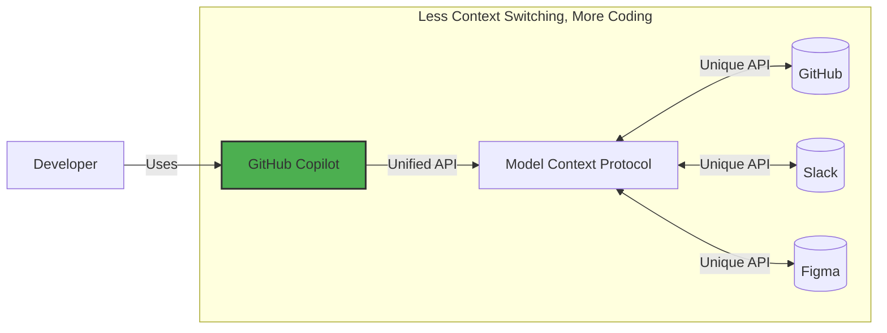

## Step 1: Introduction to MCP and environment setup


In the [Getting Started with GitHub Copilot](https://github.com/skills/getting-started-with-github-copilot) exercise, we were introduced to the Mergington High School's extracurricular activities website, which allowed students to sign up for events.

And now we have a problem... but.. it's a good one! More teachers are asking to use it! 🎉

Our fellow teachers have lots of ideas but we can't seem to keep up with all the requests! 😮 To fix this issue, lets give GitHub Copilot an upgrade by enabling Model Context Protocol (MCP). To be more specific, we will add the GitHub MCP server, which will enable a combined workflow of issue management and website upgrades. 🧑‍🚀

Let's get started!

### 📖 Theory: What is Model Context Protocol (MCP)?

[Model Context Protocol (MCP)](https://modelcontextprotocol.io/introduction) is often referred to as "USB-C for AI" - a universal connector that allows GitHub Copilot (and other AI tools) to seamlessly interact with other services.

Essentially, it is a way to describe the capabilities and requirements of a service, so AI tools can easily determine what methods to use and to accurately provide the parameters. An MCP server is providing that interface.



### :keyboard: Activity: Get to know your environment

Before we dive into MCP, let's start up our development environment and refamiliarize ourself with the extracurricular activity application.

1. Right-click the below button to open the **Create Codespace** page in a new tab. Use the default configuration.

   [](https://codespaces.new/{{full_repo_name}}?quickstart=1)

1. Validate the **Copilot Chat** and **Python** extensions are installed and enabled.

   <br/>
   

1. Verify our application runs before modification. In the left sidebar, select the **Run and Debug** tab and then press the **Start Debugging** icon.

   <details>
   <summary>📸 Show screenshot</summary><br/>

   

   </details>

   <details>
   <summary>🤷 Having trouble?</summary><br/>

   If the **Run and Debug** area is empty, try reloading VS Code: Open the command palette (`Ctrl`+`Shift`+`P`) and search for `Developer: Reload Window`.

   

   </details>

1. Use the **Ports** tab to find the webpage address, open it, and verify it is running.

   <details>
   <summary>📸 Show screenshot</summary><br/>

   

   

   </details>

### :keyboard: Activity: Add the GitHub MCP server

1. Inside your codespace, open the **Copilot Chat** panel and verify **Agent** mode is selected.

   

   <details>
   <summary>Agent mode missing?</summary><br/>

   - Verify VS Code is at least `v1.99.0`.
   - Verify the Copilot extension is at least `v1.296.0`.
   - Check if Agent mode is enabled in your [user or workspace settings](https://code.visualstudio.com/docs/configure/settings#_workspace-settings).

      

   </details>

1. Inside your codespace, navigate to the `.vscode` folder, and create a new file named `mcp.json`. Paste the following contents:

   📄 **.vscode/mcp.json**

   ```json
   {
     "servers": {
       "github": {
         "type": "http",
         "url": "https://api.githubcopilot.com/mcp/"
       }
     }
   }
   ```

1. In the `.vscode/mcp.json` file, click the **Start** button and accept the prompt to authenticate with GitHub. This has just informed GitHub Copilot of the MCP server's capabilities.

   

   <br/>

   

1. In the Copilot side panel, click the **🛠️ icon** to show the additional capabilities.

   

   

1. **Commit** and **push** the `.vscode/mcp.json` file to the `main` branch.

   > 🪧 **Note:** Pushing directly to `main` is not a recommended practice. It is only to simplify this exercise.

1. Now that your MCP server configuration is pushed to GitHub, Mona should already be busy checking your work. Give her a moment and keep watch in the comments. You will see her respond with progress info and the next lesson.

> [!NOTE]
> The next steps will involve creating GitHub issues. If you would like to avoid notification emails, you can unwatch the repository.

<details>
<summary>Having trouble?</summary><br/>

## Step 2: Agent Mode and an MCP Server for GitHub

Great work! You just connected your first MCP server to GitHub Copilot! 🎉

🚨 The teachers have been busy opening new issues in your repository with bugs and feature requests! Go [take a look](https://github.com/{{full_repo_name}}/issues) - so many good ideas!

We should probably look into them and start researching for other upgrades. Fortunately, with an MCP server for GitHub, triaging these and even doing some research to get ahead should be pretty quick! 🕵️

### 📖 Theory: How MCP Tool Calling Works in Agent Mode

Now that we have the GitHub MCP connected, let's look at how **agent mode** actually uses these external tools.

With every prompt you send, Copilot also includes the catalog (list + schema) of available tools. Copilot can then plan and decide:

- Is any tool needed for this request?
- Which tool(s) best match the intent?
- What arguments (per each tool's input schema) should be passed?

Copilot then executes the chosen tool call(s) and streams results back to the LLM.


> [!TIP]
> You can also explicitly nudge Copilot to call a specific tool by including `#<tool_name>` in your prompt (e.g `#create_pull_request`, `#codebase`).

From here, Copilot can use a set of GitHub‑aware tools to do more than just read or edit code in your repo. Here are a few things you can ask it to do:

- Discover similar public projects to get inspiration.
- Search issues considering description, comments, and likes.
- Turn the new ideas you like into issues right away so you don’t lose them.
- Retrieve an issue, make changes on a branch, and start a pull request.

Isn't that cool?! Now let's do it! 👩‍🚀

### :keyboard: Activity: Quickly find and save ideas

Let's put the GitHub MCP server to use by researching, comparing, and capturing enhancement ideas!

1. Close any open files inside your codespace. This will help reduce unnecessary context.

1. Ensure the **Copilot Chat** panel is open and **Agent** mode is selected. Verify the MCP server tools are also still available.

1. Ask Copilot to search GitHub for projects similar to this one.

   > 
   >
   > ```prompt
   > Search for any other repositories for organizing extra curricular activities
   > ```

1. When an MCP tool is required, Copilot may ask for permission. **Verify the request** and modify if necessary, then click **Continue**.

   

1. Ask Copilot to describe one of the projects. Explore until you find something you like.

   > 
   >
   > ```prompt
   > Please look at the code for the 3rd option and give me a detailed description of the features.
   > ```

1. Use Copilot to compare and generate ideas for enhancements.

   > 
   >
   > ```prompt
   > Please compare these features to our project. Which would be new?
   > ```

1. Nice! Let's have Copilot create issues to save these ideas.

   > 
   >
   > ```prompt
   > I like it. Let's create issues for these in my repository.
   > ```

1. Copilot will ask for permission to create issues on your repository. Click **Continue** for each new issue. Reminder: **verify the request** before running.

   

1. Since we are done researching, let's finish this chat session to clear the context. At the top of the **Copilot Chat** panel, click the **New Chat** icon (plus sign).

1. With the new issues created, Mona should already be busy checking your work. Give her a moment and keep watch in the comments. You will see her respond with progress info and the next lesson.

> [!NOTE]
> The Model Context Protocol (MCP) landscape is quickly evolving. Many servers, including the [Official GitHub MCP server](https://github.com/github/github-mcp-server) are in active development and do not have full parity with their stable APIs.

Make sure:

## Step 3: Solve issues with Agent Mode and GitHub MCP Server

Great work doing that research and finding a potential collaboration opportunity.
Not only did we find some new ideas to help organize extracurricular activities, but we did all that quickly too.

Now, let's use our MCP server's tools and Copilot to do a bit of triage and get some work done.

### :keyboard: Activity: Easily implement an important issue

The issue backlog is piling up. Let’s finally tackle one, but which deserves our attention first?

1. Ensure the **Copilot Chat** panel is open and **Agent** mode is selected. Verify the MCP server tools are also still available.

1. Ask Copilot about the open issues on this repository.

   > 
   >
   > ```prompt
   > How many open issues are there on my repository?
   > ```

   > 🪧 **Note:** Check that the List Issues tool is called with proper parameters.

1. Ask Copilot to summarize the important issues.

   > 
   >
   > ```prompt
   > Oh no. That's too many for me! Please get the list of issues,
   > review the descriptions and comments, and pick the top 3 most important.
   > ```

   <details>
   <summary> <b> 💡 Tip:</b> Pre-authorize tool usage</summary><br/>

   If Copilot uses a tool often, you can proactively grant permission for the rest of the conversation session.

   

   </details>

1. Review the suggested issues. If Copilot didn't give a specific recommendation, try providing some feedback to narrow the results.

1. With the list narrowed, ask Copilot to implement an issue. **Mona won't grade if the changes work, just that an attempt was made.**

   > 
   >
   > ```prompt
   > #codebase Let's do the first one. Follow these steps:
   > 1. Checkout a new local branch for making our changes.
   > 2. Make the changes then confirm with me that they look correct.
   > 3. Push the changes and create a pull request.
   > ```

   > ⚠️ **Warning:** Always verify the the actions Copilot is asking to perform, especially with the external abilities provided by an MCP server, which probably have no undo option.

1. Once the pull request is created, Mona will start checking your work. Give her a moment and keep watch of the comments. You will see her respond with progress info and the next step!

<details>
<summary>Having trouble?</summary><br/>

- If tools are not being requested, verify your MCP configuration is correct.
- If Copilot cannot retrieve results, verify you are using this Codespace's token or a Personal Access Token (PAT) with appropriate permissions. By default, the codespace token we are using only has access to this repository.

</details>

- Your `.vscode/mcp.json` file is similar to the example provided.
- You pushed the changes to the `main` branch.

</details>


## Step 4: Validating AI-generated code

Great work on implementing that issue! Our extracurricular activities site is getting better every day! 💚

While AI assistants like GitHub Copilot can dramatically improve productivity, it's essential to remember that **_you_** are responsible for reviewing and validating all work, generated or not.

> [!tip]
> In real projects, many teams use [GitHub Actions](https://github.com/features/actions) to setup automated testing.

### :keyboard: Activity: Review and merge the AI solution

1. Open the new pull request created by Copilot in a new tab.

   []({{pull_request_url}})

   > ✨ **Bonus:** If your Copilot subscription provides it, you can also use a specialised version of Copilot to [review the changes](https://docs.github.com/en/copilot/using-github-copilot/code-review/using-copilot-code-review?tool=webui).

1. Review the changes. When you are satisfied, merge the pull request.

1. Return to VS code and the active **Copilot Chat** session.

   > 🚨 **Important:** If you previously clicked Done and need to return to a previous conversation, use the **Show Chats** button at the top of the Copilot Chat panel to restore it.

1. Ask Copilot to add a comment to the issue we just finished, and to say thanks for the comments and ideas.

   > 
   >
   > ```prompt
   > Add a closing comment to the issue we just finished. Provide a 1 sentence description
   > of the implemented solution and thank the commenters for their ideas and feedback.
   > ```

   <details>
   <summary>Having trouble? 🤷</summary><br/>

   Some things to check

   - Is your MCP Server still running?
   - Check what information is passed to the MCP server calls - is Copilot using the correct repository?
   - Did Copilot comment on the bug report?
   </details>

1. Once the comment has been created, Mona will start checking your work. Give her a moment to provide feedback or share the final review. Nice work! You're all done! 🎉

## Review

_Congratulations, you've completed this exercise and learned how to integrate MCP with GitHub Copilot!_


Here's a recap of what you learned:

- **MCP Server Configuration**: Setting up and connecting the GitHub MCP server to Copilot
- **Agent Mode with MCP**: Using natural language to interact with external services through MCP tools
- **GitHub Repository Research**: Searching for and analyzing similar projects using MCP capabilities
- **Issue Management & Implementation**: Triaging, creating, and managing GitHub issues through Copilot, then having Copilot solve issues for you

### What's next?

Check out these resources to learn more or get involved:

- [Take another GitHub Skills exercise](https://learn.github.com/skills).
- Learn more about [Model Context Protocol](https://modelcontextprotocol.io/introduction)
- Explore the [GitHub MCP Registry](https://github.com/mcp) and try out other servers!

